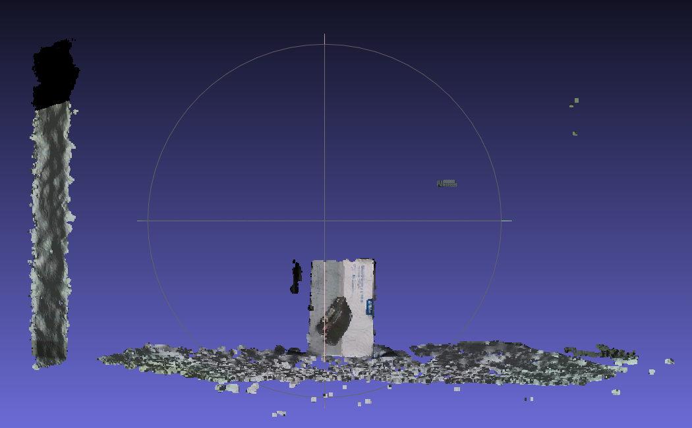
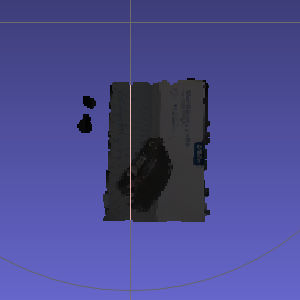
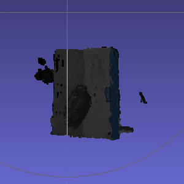

# 3D-Modeling

## 軟體環境

C++    : [PCL 1.9.1](https://github.com/PointCloudLibrary/pcl) , [RealSense](https://github.com/IntelRealSense)

Python : [Open3D](http://www.open3d.org/)

## 開發進度

1. 以Intel RealSense取得RGB-D Point Cloud

2. 在C++對Point Cloud進行Object Extraction

3. Python中使用Color ICP進行Alignment & Stitch

## 未完成部份

- RealSense Preset
- 拼接結果
	- 目前Stitch結果有些微錯位, 經過多個Frame疊合後錯位部份會變得明顯
	可嘗試加入Kick-Out Rule排除掉取像不佳的Frame, 以及調整ICP參數
- C++ & Python整合 or 使用Open3D C++ Library(需確認是否支援Color ICP)
- Filter後Point Cloud顏色變暗, 待確認原因

## Reference

- [Mini-3D-Scanner](https://github.com/zjudmd1015/Mini-3D-Scanner)
	以ROS串接Kinect V2(Capture), C++(Preprocessing), Python(Alignment&Stitch)
	實現3D建模
- [PCL Segment](https://codertw.com/%E7%A8%8B%E5%BC%8F%E8%AA%9E%E8%A8%80/559948/)
